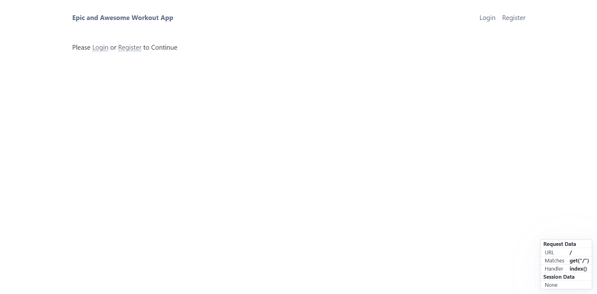
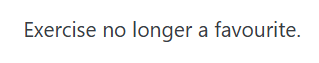
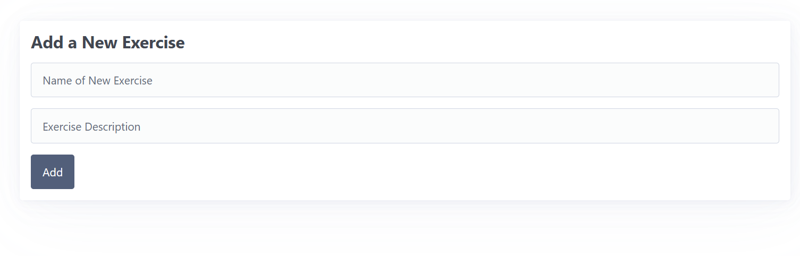

# Sprint 2 - A Minimum Viable Product (MVP)

## Sprint Goals

Develop a bare-bones, working web application that provides the key functionality of the system, then test and refine it so that it can serve as the basis for the final phase of development in Sprint 3.

---

## Implemented Database Schema

- Users Table Holds the info about each user, it links to the workout table to show who owns each workout, and it links to the favourites table to allow the users to favourite exercises.

- Favourites Table links to users and exercises allowing users to favourite exercises

- Workout Table holds each users workout info, links to users and exercises, to show what exercise the user did in their workout

- Exercise Table holds each exercises information, which all users can see and complete a workout with, this table links to the workout table, and the favourites table, for each user to have favourites.

.png)

---

## Initial Implementation

The key functionality of the web app was implemented:

---

## Exercise Table

I'm getting the exercise Table to show favourites, owned and others separately, but the symbol to show the owned in the favourites I can't get to show

### Changes / Improvements

The problem was I wasnt pulling the exercises user id to compare with the sessions user id, so i fixed that

---

## Favouriting and Unfavouiting exercises

I've added the favourite route and button and now i will try to favourite and unfavourite an exercise

**PLACE SCREENSHOTS AND/OR ANIMATED GIFS OF THE TESTING HERE**

### Changes / Improvements

The error was a result of me using the wrong method in my route, I was using the post method when i needed to use the GET method

**PLACE SCREENSHOTS AND/OR ANIMATED GIFS OF THE IMPROVED SYSTEM HERE**

---

## Workouts Table

I've made the workouts table to show all of the data for each workout

### Changes / Improvements

I showed it to my end-user to see what they thought and they reminded me I needed to add a delete button in the table, but other than that it was all good.

---

## Deleting Workouts

I made the route for deleting workouts, and then tried to use it, the item was being delted from the table, but the return redirect waasnt working.

### Changes / Improvements

The problem was that i wasnt passing through the exercise id into the route, so it couldnt look for the exercise. Instead of passing it through i used request referrer to go back to the previous page

---

## Adding exercises

When adding the exercise the user would need to scroll down somewhat far depending on the amount of exercises

### Changes / Improvements

To fix this i spoke to my end-user to see what they wanted me to do, and they said to make the add exercise form be on an entirly separate page, that the users can get to by clicking the add exercise button.

---

## Testing FEATURE NAME HERE

Replace this text with notes about what you are testing, how you tested it, and the outcome of the testing

**PLACE SCREENSHOTS AND/OR ANIMATED GIFS OF THE TESTING HERE**

### Changes / Improvements

Replace this text with notes any improvements you made as a result of the testing.

**PLACE SCREENSHOTS AND/OR ANIMATED GIFS OF THE IMPROVED SYSTEM HERE**

---

## Testing FEATURE NAME HERE

Replace this text with notes about what you are testing, how you tested it, and the outcome of the testing

**PLACE SCREENSHOTS AND/OR ANIMATED GIFS OF THE TESTING HERE**

### Changes / Improvements

Replace this text with notes any improvements you made as a result of the testing.

**PLACE SCREENSHOTS AND/OR ANIMATED GIFS OF THE IMPROVED SYSTEM HERE**

---

## Testing FEATURE NAME HERE

Replace this text with notes about what you are testing, how you tested it, and the outcome of the testing

**PLACE SCREENSHOTS AND/OR ANIMATED GIFS OF THE TESTING HERE**

### Changes / Improvements

Replace this text with notes any improvements you made as a result of the testing.

**PLACE SCREENSHOTS AND/OR ANIMATED GIFS OF THE IMPROVED SYSTEM HERE**

---

## Sprint Review

This sprint has helped to move the project forward by providing a solid and function base for the system, the main goals of the sprint have been met, as the syetm is now readsy to be refined into the final product in sprint 3.

Key success points:
 - The MVP has been finished and tested, meaning it is now ready to be made into  the final product
 - All tables in the database link correctly and have been implemented properly
 - The core functionality of the website has been provided
 - I was able to improve the site through user feedback
 - Many bugs were able to be fixed especially errors in the routes

 Challenges:
 - Small issues with route methods at one point, whioch took a while to realise the error
 - delete redirect not working due to missing parameters also took a while to find a solution

