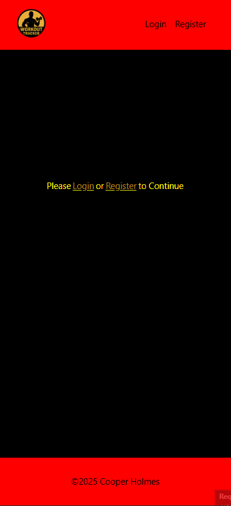
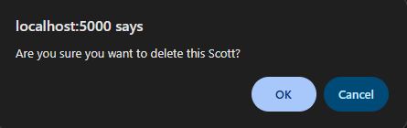

# Sprint 3 - A Refined and Complete System

## Sprint Goals

Develop the system until it is fully featured, with a refined UI and it satisfies the requirements. The system will be fully tested at this point.

---

## Final Implementation

The web app is fully implemented with a refined UI:

---

## Asking are you sure when deleting workouts

When deleting workouts there is no asking 'are you sure' before it is deleted

### Changes / Improvements

My end user said they do want there to be a small pop up asking if they are sure, in case they press delete by mistake.

---

## Exercise list

Looking at the exercise list when on a screen larger than a phone it can seem too wide, with the titles being really far apart

### Changes / Improvements

Talking to my end-user they said they would prefer that when on the exercise list it had a set width, so it never gets too wide

---

## Add Exercise Button

The add exercise button is in on position on the page, and can be somewhat difficult to find if at the bottom, and the user is needed to scroll

### Changes / Improvements

my end user said i should have the button fixed in the corner of the screen

---

## Exercise Description

When there are enough workouts completed for one exercise, the description can be off the page and require scrolling to get to

### Changes / Improvements

My end-user said to have the description be above the workouts, allowing the users to scroll to see workouts from earlier dates.

---

## Owned Favourites

When an exercise is both owned and favourited they should be at the top of the favourites list, but currently they are just in their normal position, based on alphabetical order

### Changes / Improvements

After speaking to my End-User I confirmed they wanted the owned on top, so to fix this i separated the favourites section into two printings of favourites, the first being owned, the second not owned

---

## Html Validation

Home Page:

Exercise Page:

Add Workout Form:

Add Exercise Form:

Login Form:

Register Form:

### Changes / Improvements

Home Page:
I created 3 ul sections and had the h2 outside of the sections

Exercise Page:
to fix this i turned the description section into a div tag rather than an article tag, as a div does not need a header

---

## Sprint Review

This Sprint has helped to move thr project forward by refining and finishing the system, which is now fully functional and teh final product, I have met the main goals of this sprint, after testing commonly with end user feedback.

Key success points:
- The system is now complete
- The UI has been refined to be more user friendly following UX principles and relevant implications
- All pages pass HTML validation checks
- All minor bugs and errors have been fixed

Challenges:
- some minor layout issues took time to identify and fix, especially with changes on different screen sizes
- Consistent design across screen sizes took time to ensure

