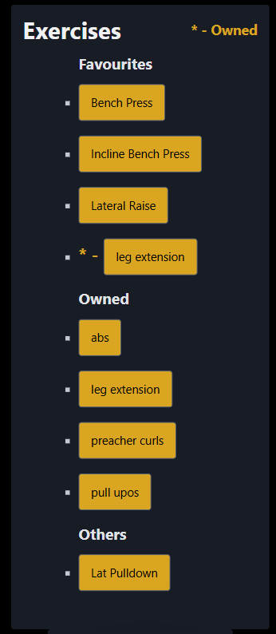

# Sprint 3 - A Refined and Complete System

## Sprint Goals

Develop the system until it is fully featured, with a refined UI and it satisfies the requirements. The system will be fully tested at this point.

---

## Final Implementation

The web app is fully implemented with a refined UI:

**PLACE SCREENSHOTS AND/OR ANIMATED GIFS OF THE SYSTEM HERE**

---

## Asking are you sure when deleting workouts

When deleting workouts there is no asking 'are you sure' before it is deleted

### Changes / Improvements

My end user said they do want there to be a small pop up asking if they are sure, incase they press delete by mistake.

---

## Exercise list

Looking at the exercise list when on a screen larger than a phone it can seem too wide, with the titles being really far apart

### Changes / Improvements

Talking to my end-user they said they would prefer that when on the exercise list it had a set width, so it never gets too wide

---

## Add Exercise Button

The add exercise button is in on position on the page, and can be somehwat difficult to find if at the bottom, and the user is needed to scroll

### Changes / Improvements

my end user said i should have the button fixed in the corner of the screen

---

## Testing FEATURE NAME HERE

Replace this text with notes about what you are testing, how you tested it, and the outcome of the testing

**PLACE SCREENSHOTS AND/OR ANIMATED GIFS OF THE TESTING HERE**

### Changes / Improvements

Replace this text with notes any improvements you made as a result of the testing.

**PLACE SCREENSHOTS AND/OR ANIMATED GIFS OF THE IMPROVED SYSTEM HERE**

---

## Testing FEATURE NAME HERE

Replace this text with notes about what you are testing, how you tested it, and the outcome of the testing

**PLACE SCREENSHOTS AND/OR ANIMATED GIFS OF THE TESTING HERE**

### Changes / Improvements

Replace this text with notes any improvements you made as a result of the testing.

**PLACE SCREENSHOTS AND/OR ANIMATED GIFS OF THE IMPROVED SYSTEM HERE**

---

## Sprint Review

Replace this text with a statement about how the sprint has moved the project forward - key success point, any things that didn't go so well, etc.

